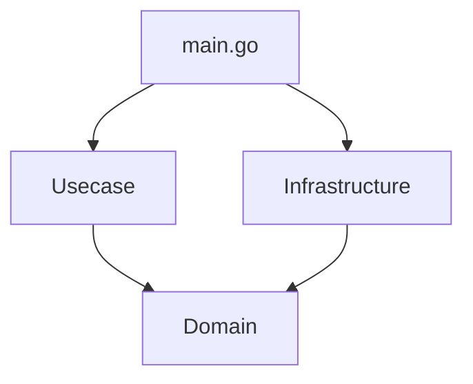

# API Layer

This directory contains API-related applications.

## ToDo Application

A sample ToDo application is included in the `todo` subdirectory.

### Architecture

The ToDo application follows a layered architecture:

- **Domain**: Contains the core business logic and data structures (e.g., `Todo` model, `TodoRepository` interface).
- **Usecase**: Contains the application-specific business rules and orchestrates the flow of data using the domain layer.
- **Infrastructure**: Contains the implementation of the interfaces defined in the domain layer (e.g., an in-memory `TodoRepository`).



### How to Run

To run the ToDo application, use the following command from the `api-layer` directory:

```bash
cd api-layer
go run ./todo/main.go
```
